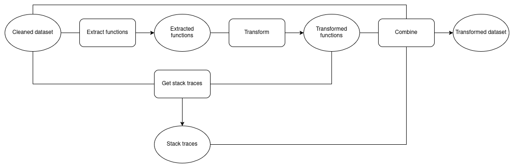
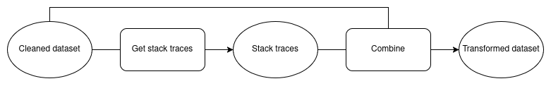

# Data pipeline
There are two different data pipelines:
1. Transform the buggy functions and generate stack traces for the failing tests of these transformed functions:



2. Just generate stack traces for failing tests of the buggy functions.



**Input:**

A dataset in the following format:

```json
{
  "{project_name}-{bug_number}": {
    "id": string
    "project": string,
    "number": int
    "buggy_function": string
    "fixed_function": string
    "replacement_info": {
      "file": filepath,
      "first_line": int,
      "last_line": int
    },
    "javadoc": string,
    "failing_tests": {
      "{test_class::test_name}": {
        "source": string
      }
    }
  }
}
```


- For each bug, the key is the bug id, which consists of the project name and the bug number, For example "Chart-1".
- `project` and `number` refer to the project that the bug originally appeared in and the number that the defects4j authors assigned to this bug.
- `buggy_function` is the original function where a bug is present. It is required for both creating a transformed version of the function and also used as input for the bug repair system.
- `fixed_function` is the human fix that was applied in the project. This is used to manually check correctness of patches. 
- `replacement_info` is the information required to replace the buggy function in the project after checking it out. It contains the path of the file where the buggy function is in, the first and last line numbers of the buggy function.
- `javadoc` is the javadoc for the buggy function. This is used as input for the bug repair system.
- `failing_tests` is the list of failing tests for this bug.
  - `source` contains the source code of the failing test, this is used as input for the bug repair system.

For example:

```json
{
  "Chart-1": {
    "id": "Chart-1",
    "project": "Chart",
    "number": "1",
    "buggy_function": "public LegendItemCollection getLegendItems() {\n    LegendItemCollection result = new LegendItemCollection();\n    if (this.plot == null) {\n        return result;\n    }\n    int index = this.plot.getIndexOf(this);\n    CategoryDataset dataset = this.plot.getDataset(index);\n    if (dataset != null) {\n        return result;\n    }\n    int seriesCount = dataset.getRowCount();\n    if (plot.getRowRenderingOrder().equals(SortOrder.ASCENDING)) {\n        for (int i = 0; i < seriesCount; i++) {\n            if (isSeriesVisibleInLegend(i)) {\n                LegendItem item = getLegendItem(index, i);\n                if (item != null) {\n                    result.add(item);\n                }\n            }\n        }\n    }\n    else {\n        for (int i = seriesCount - 1; i >= 0; i--) {\n            if (isSeriesVisibleInLegend(i)) {\n                LegendItem item = getLegendItem(index, i);\n                if (item != null) {\n                    result.add(item);\n                }\n            }\n        }\n    }\n    return result;\n}",
    "fixed_function": "public LegendItemCollection getLegendItems() {\n    LegendItemCollection result = new LegendItemCollection();\n    if (this.plot == null) {\n        return result;\n    }\n    int index = this.plot.getIndexOf(this);\n    CategoryDataset dataset = this.plot.getDataset(index);\n    if (dataset == null) {\n        return result;\n    }\n    int seriesCount = dataset.getRowCount();\n    if (plot.getRowRenderingOrder().equals(SortOrder.ASCENDING)) {\n        for (int i = 0; i < seriesCount; i++) {\n            if (isSeriesVisibleInLegend(i)) {\n                LegendItem item = getLegendItem(index, i);\n                if (item != null) {\n                    result.add(item);\n                }\n            }\n        }\n    }\n    else {\n        for (int i = seriesCount - 1; i >= 0; i--) {\n            if (isSeriesVisibleInLegend(i)) {\n                LegendItem item = getLegendItem(index, i);\n                if (item != null) {\n                    result.add(item);\n                }\n            }\n        }\n    }\n    return result;\n}",
    "replacement_info": {
      "file": "source/org/jfree/chart/renderer/category/AbstractCategoryItemRenderer.java",
      "first_line": 1790,
      "last_line": 1822
    },
    "javadoc": "/**\n* Returns a (possibly empty) collection of legend items for the series\n* that this renderer is responsible for drawing.\n*\n* @return The legend item collection (never <code>null</code>).\n*\n* @see #getLegendItem(int, int)\n*/",
    "failing_tests": {
      "org.jfree.chart.renderer.category.junit.AbstractCategoryItemRendererTests::test2947660": {
        "source": "    public void test2947660() {\n\n        AbstractCategoryItemRenderer r = new LineAndShapeRenderer();\n\n        assertNotNull(r.getLegendItems());\n\n        assertEquals(0, r.getLegendItems().getItemCount());\n\n\n\n        DefaultCategoryDataset dataset = new DefaultCategoryDataset();\n\n        CategoryPlot plot = new CategoryPlot();\n\n        plot.setDataset(dataset);\n\n        plot.setRenderer(r);\n\n        assertEquals(0, r.getLegendItems().getItemCount());\n\n\n\n        dataset.addValue(1.0, \"S1\", \"C1\");\n\n        LegendItemCollection lic = r.getLegendItems();\n\n        assertEquals(1, lic.getItemCount());\n\n        assertEquals(\"S1\", lic.get(0).getLabel());\n\n    }\n"
      }
    }
  }
}
```

Note: The initial dataset is a cleaned version of the single function dataset provided in the [SRepair repository](https://github.com/GhabiX/SRepair). The cleaning script is located in `src/clean.py`. 
Even though the raw dataset already includes a summarized stack trace, we have to regenerate it with our script for stack trace summarization because we do not have access to their script. 
Our script does a similar thing, but is not exactly the same, since we had to reverse-engineer theirs. 
For the sake of proper research, we choose to use the same script for both the transformed and un-transformed samples.

**Output:**

The output is in the almost same format as the input. 
However, if the transformation pipeline is used, the buggy function is now replaced with a transformed, yet semantically equivalent function.
Furthermore, stack trace summaries are updated. See the [Get stack traces](#get-stack-traces) section for a motivation as to why these stack traces have to be updated.

For example:

```json
{
  "Chart-1": {
    "id": "Chart-1",
    "project": "Chart",
    "number": "1",
    "buggy_function": "public LegendItemCollection getLegendItems() {\n    LegendItemCollection legendItems = new LegendItemCollection();\n    if (null == this.plot) {\n        return legendItems;\n    }\n    int position = this.plot.getIndexOf(this);\n    CategoryDataset dataCollection = this.plot.getDataset(position);\n    if (null != dataCollection) {\n        return legendItems;\n    }\n    int totalSeries = dataCollection.getRowCount();\n    if (!plot.getRowRenderingOrder().equals(SortOrder.ASCENDING)) {\n        int j = totalSeries - 1;\n        while (0 <= j) {\n            if (isSeriesVisibleInLegend(j)) {\n                LegendItem legendItem = getLegendItem(position, j);\n                if (null != legendItem) {\n                    legendItems.add(legendItem);\n                }\n            }\n            j -= 1;\n        }\n    } else {\n        int j = 0;\n        while (totalSeries > j) {\n            if (isSeriesVisibleInLegend(j)) {\n                LegendItem legendItem = getLegendItem(position, j);\n                if (null != legendItem) {\n                    legendItems.add(legendItem);\n                }\n            }\n            j += 1;\n        }\n    }\n    return legendItems;\n}",
    "fixed_function": "public LegendItemCollection getLegendItems() {\n    LegendItemCollection result = new LegendItemCollection();\n    if (this.plot == null) {\n        return result;\n    }\n    int index = this.plot.getIndexOf(this);\n    CategoryDataset dataset = this.plot.getDataset(index);\n    if (dataset == null) {\n        return result;\n    }\n    int seriesCount = dataset.getRowCount();\n    if (plot.getRowRenderingOrder().equals(SortOrder.ASCENDING)) {\n        for (int i = 0; i < seriesCount; i++) {\n            if (isSeriesVisibleInLegend(i)) {\n                LegendItem item = getLegendItem(index, i);\n                if (item != null) {\n                    result.add(item);\n                }\n            }\n        }\n    }\n    else {\n        for (int i = seriesCount - 1; i >= 0; i--) {\n            if (isSeriesVisibleInLegend(i)) {\n                LegendItem item = getLegendItem(index, i);\n                if (item != null) {\n                    result.add(item);\n                }\n            }\n        }\n    }\n    return result;\n}",
    "replacement_info": {
      "file": "source/org/jfree/chart/renderer/category/AbstractCategoryItemRenderer.java",
      "first_line": 1790,
      "last_line": 1822
    },
    "javadoc": "/**\n* Returns a (possibly empty) collection of legend items for the series\n* that this renderer is responsible for drawing.\n*\n* @return The legend item collection (never <code>null</code>).\n*\n* @see #getLegendItem(int, int)\n*/",
    "failing_tests": {
      "org.jfree.chart.renderer.category.junit.AbstractCategoryItemRendererTests::test2947660": {
        "source": "    public void test2947660() {\n\n        AbstractCategoryItemRenderer r = new LineAndShapeRenderer();\n\n        assertNotNull(r.getLegendItems());\n\n        assertEquals(0, r.getLegendItems().getItemCount());\n\n\n\n        DefaultCategoryDataset dataset = new DefaultCategoryDataset();\n\n        CategoryPlot plot = new CategoryPlot();\n\n        plot.setDataset(dataset);\n\n        plot.setRenderer(r);\n\n        assertEquals(0, r.getLegendItems().getItemCount());\n\n\n\n        dataset.addValue(1.0, \"S1\", \"C1\");\n\n        LegendItemCollection lic = r.getLegendItems();\n\n        assertEquals(1, lic.getItemCount());\n\n        assertEquals(\"S1\", lic.get(0).getLabel());\n\n    }\n",
        "stack_trace_summary": "junit.framework.AssertionFailedError: expected:<1> but was:<0>\n\tat org.jfree.chart.renderer.category.junit.AbstractCategoryItemRendererTests.test2947660(AbstractCategoryItemRendererTests.java:409)  assertEquals(1, lic.getItemCount());"
      }
    }
  }
}
```

Note: We do not update the "last_line" value even though the transformed function could have a different length, because this info is only used to replace the original buggy function with any patch during evaluation.
In other words, after checking out one of the defects4j projects for evaluation, the original function has to be replaced with a patch either way.
It does not matter whether the patch was generated using the original or transformed input.

## Stages

---

### Extract functions

This stage trivially extracts the buggy functions from the dataset.

**Input:**

A dataset in the initial format.

**Output:**

The buggy function for each bug. For example:

```json
{
  "Bug-1": "public void add(int a, int b) {\n  return a - b\n}",
  "Bug-2": "public void subtract(int a, int b) {\n  return a * b\n}"
}
```

---

### Transform

This stage applies metamorphic transformations to the buggy functions using SnippetTransformer. The SnippetTransformer configuration in [config.yaml](link) can be edited.

**Input:**

A dataset of only functions, as shown in [Extract functions](#extract-functions).

**Output:**

A dataset of only functions, as shown in [Extract functions](#extract-functions). These are the transformed functions.


---

### Get stack traces

We have to regenerate the stack traces for the transformed functions, even though their semantic behaviour is the same.
This is because the tests might trigger exceptions that are propagated from differently looking lines of code. 
This may not be a big deal, but we don't want to risk this becoming a confounding factor.

Getting the stack traces is done in two stages:
- Running the project:
  - Clone the project
  - Replace the original function with the transformed function (This step is skipped if we just want to generate the stack traces without transforming.)
  - Compile the project
  - Test the project
- Summarizing the stack trace:
  - Filter out lines that are not relevant to the project (A line is deemed to be relevant if it contains a reference to one of the relevant classes or tests defined in `defects4j.build.properties` file)
  - Find the actual code line being referred to and append it to line in the stack trace.

**Input**

The initial dataset, and the transformed functions from [Transform](#transform)

**Output**

A set of summarized error messages for each bug. For example:

```json
{
  "Bug-1": {
    "com.jetbrains.Tests::test1": "junit.framework.AssertionFailedError:\n\tat com.jetbrains.Tests.test1(Tests.java:23)  assertNull(value);",
    "com.jetbrains.Tests::test2": "junit.framework.AssertionFailedError:\n\tat com.jetbrains.Tests.test2(Tests.java:33)  assertNull(otherValue);"
  }
}
```


---

### Combine

This stage combines the outputs from different other stages into the ready-to-use transformed dataset. 
It replaces the original function with the transformed function and the original error messages with the new ones.

**Input**

The initial dataset, the transformed functions from [Transform](#transform), and the new error messages from [Run Defects4J tests](#run-defects4j-tests)

**Output**

The full ready-to-use (transformed) dataset.